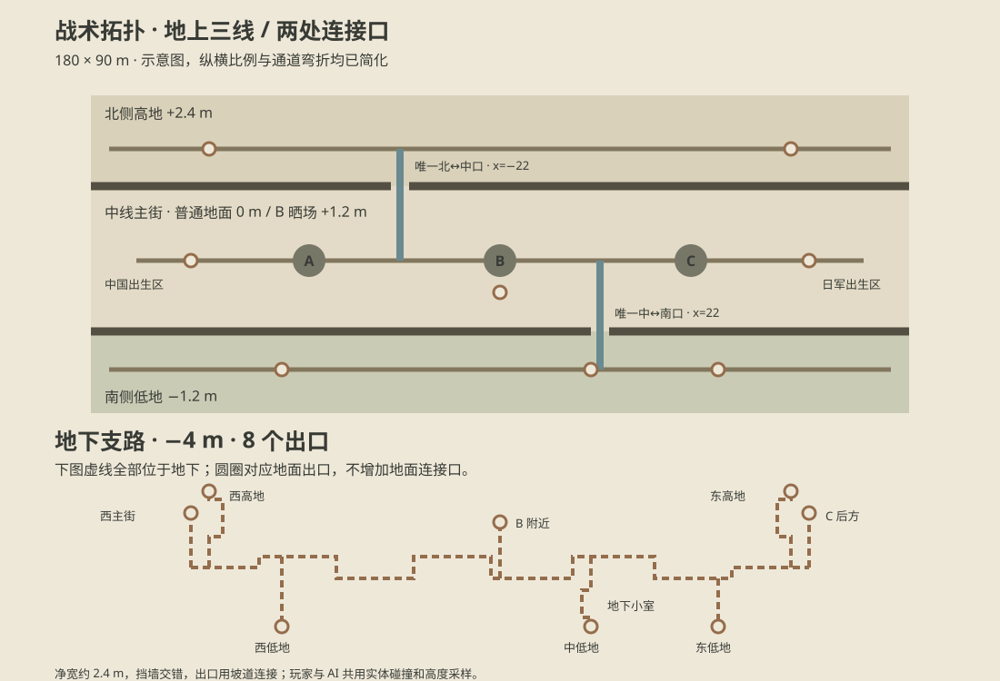

# 烽火乡关 · Web FPS Alpha

Vite + TypeScript + Babylon.js；一名中国方玩家、七名中国方 AI、八名日军 AI，单地图据点争夺。无需服务器、账号或外部素材下载。

## 运行

安装 Node.js 22.12+（或 24 LTS），在项目目录执行：

```sh
npm install
npm run dev
```

在 **Chrome 或 Edge 的独立桌面窗口**打开终端给出的本地地址（默认 http://localhost:5173），点击「开始作战」。浏览器需要 WebGL 和 Pointer Lock。嵌入式预览可能不允许锁定鼠标。

```sh
npm run build
npm run preview
npm test
```

开发模式提供 `window.__game` 供验收；生产构建不暴露该入口。所有运行资源打包在本项目内，首次安装需要访问 npm。

## 操作

| 操作 | 按键 |
| --- | --- |
| 移动 / 鼠标视角 | WASD / 鼠标 |
| 奔跑 / 蹲下 / 跳跃 | Shift / Ctrl 或 C / Space |
| 开火或挥砍 / 瞄准 | 左键 / 按住右键 |
| 装填 / 步枪 / 大刀 | R / 1 / 2 |
| 暂停并释放鼠标 | Esc |
| 开发模式：路线图、掩体点、AI 状态及资源统计 | F3 |

步枪弹仓 5 发，开枪后自动拉栓 1.5 秒；身体 75、头部 150 伤害。R 装填耗时 3.2 秒，备用弹药不限。大刀伤害 100、范围 2.1 m；日军军刀伤害 95、范围 2.2 m。队友会挡住射线，但不开启友军伤害。出生后有 2.5 秒保护。

## 一局的规则

- 双方各 100 兵力；每次阵亡消耗 1，5 秒后在各自固定出生区重生。
- A 西院祠堂、B 中央晒场、C 东村粮仓。旗杆、地面细圈和 HUD 标示据点。
- 单方在半径 7 m 内持续占领；双方同时在内时停止。先中立化敌方据点，再完成转换。地道中的角色不会隔着地面占点。
- 控制两个点每 7 秒扣除敌方 1 兵力，三个点每 7 秒扣 2。
- 兵力归零立即结束；12 分钟时剩余兵力较多的一方胜利，完全相同时加时至出现兵力差。
- Esc 暂停整局。结算后点击「重新开始一局」，复用场景并重置双方、兵力、据点和玩家武器。

## 地图与地道

范围仍为 180 × 90 m，西侧中国出生区、东侧日军出生区。人工地形分为普通地面 0 m、北侧高地 +2.4 m、南侧沟渠 −1.2 m、地下 −4 m；B 点晒场升高至 +1.2 m。视觉网格、玩家碰撞和 AI 导航共用高度采样。主街设交错土墙，地道设连续折角挡墙。

**地上只有三条纵向战线，横向连接口合计两处。** 北线与中线之间的连续隔墙位于 z=16，仅在 A/B 之间 x=−22 留 4 m 石阶口；中线与南线之间的隔墙位于 z=−32，仅在 B/C 之间 x=22 留 4 m 坡道口。隔墙延伸到地图边界，跳跃和绕端头均不增加连接口。院落中的局部绕障仍留在各自战线内。



地道负责主要转线与绕后，共 **8 个地面出口**。沿木牌和土坡直接进出，无需交互按键、没有传送：

| 地面区域 | 出入口坐标 x / z（m） | 连接 |
| --- | --- | --- |
| 西侧、中部 B 附近、C 后方 | −68 / −13、0 / −13、68 / −13 | 原有三处主街入口 |
| 北侧高地西部、东部 | −64 / 26、64 / 26 | 两条带转角的北向支路 |
| 南侧低地西部、中部、东部 | −48 / −40、20 / −40、48 / −40 | 三条南向坡道，中部经过地下小室 |

地下通道净宽约 2.4 m、净高约 2.3 m，挡墙和转角限制长视线。出口有木牌，通道内有木支撑与少量油灯；多处灯具共用一盏就近实时灯。

AI 继续使用原有状态机，地面网格扩展为 `TacticalRouteGraph`，用显式坡道边连接地下与地上。出生、重生及据点变化会重新评估目标；路线人数、B 点压力和高地威胁参与评分。高/低路线先经过相应战线的战术路标，再前往据点，避免“选择了高地路线却始终走主街”。显式掩体点提供停留、蹲伏、探身和推进；卡住时重新寻路。

## 结构

- `src/config/gameConfig.ts`：生命、移速、武器、AI、占领、兵力和对局时长。
- `src/game/`：游戏循环、命中检测、伤害与结算。
- `src/player/`、`src/weapons/`：输入、碰撞、瞄准、拉栓与装填。
- `src/ai/`：状态机、路线偏好、低模角色与程序姿态。
- `src/capture/`：据点规则和场景标记。
- `src/map/Topology.ts`：两处地面连接口、地道出口与转角的共享定义。
- `src/map/Terrain.ts`、`TopologyGeometry.ts`：人工高低差、连续隔墙、地下支路几何。
- `src/map/TacticalRouteGraph.ts`、`CoverPoints.ts`：跨层导航与预定义掩体。
- `src/core/Diagnostics.ts`：每 30 秒采样、错误记录和 F3 调试；最近记录保存在 sessionStorage。
- `src/ui/`、`src/audio/`、`src/effects/`：HUD、合成占位音效、复用特效池。

## 资产与 Alpha 范围

角色按照用户提供的 `public/reference/chinese_uniform.jpg.jpg` 和 `japanese_uniform.jpg.jpg` 制作灰色八路军式、卡其日军式程序化外形；统一布军装、软帽、皮带、绑腿、时代风格步枪与刀。村庄参照 `village_reference.jpg.png` 的土石院墙与瓦房特征。参考图仅作视觉依据，不作为游戏纹理。

这是以完整可玩为目标的低模 Alpha：角色和枪械为原创简单几何体，动画为程序姿态；音效为 Web Audio 合成占位；房屋外壳不开放室内；无布料、布娃娃、大型物理或联网。静态场景按材质/区域合并，角色刚性部件合并并保留四肢枢轴，特效复用，单方向光、环境光和一盏就近地道油灯。性能取决于显卡和浏览器，不能将开发机测试结果视为所有办公电脑的 60fps 保证。

## 浏览器验收

`tests/rules.test.ts` 可通过 `npm test` 运行据点、兵力和结算测试。`tests/gameplay.mjs` 与 `tests/input-and-tunnel.mjs` 是 Edge/Chrome 的完整对局、真实键鼠输入与地道通行验收脚本；需本机已有目标浏览器、正在运行 dev server，并另外提供 Playwright（`npm install --no-save playwright`，或用 `PLAYWRIGHT_MODULE` 指向现有安装）。

```sh
node tests/gameplay.mjs final
node tests/input-and-tunnel.mjs
node tests/topology.mjs
node tests/tactical.mjs
node tests/lifecycle-audit.mjs
node tests/soak.mjs
```

结果和截图写入已忽略的 `test-results/`。`TEST_BROWSER=chrome` 可切换 Chrome；默认 Edge。详细完成记录见 `VALIDATION.md`。

`topology.mjs` 检查两处地面通口、跨墙/跳跃封闭、地下重新连通三条战线及 F3 对象复用。`tactical.mjs` 用真实 AI 移动与碰撞走完跨层路线；键鼠脚本另用玩家控制器走过全部出口。`soak.mjs` 默认连续运行 900 秒真实时间，正常渲染并自动开始下一局；`SOAK_SECONDS` 和 `SOAK_NAME` 可指定时长及报告名称。此阶段按要求暂缓闪退根因调查，连续运行结果仅代表本机本次验证。

## 本轮程序材质与战斗反馈

本轮在保持 Combat Map V2、8v8 对局、TacticalRouteGraph、据点和性能优化框架不变的前提下，完成第一阶段环境材质与战斗反馈升级。

主要内容包括：

- 引入程序化环境材质体系，用于村庄地面、墙体、木材等低成本视觉表现；
- 参考 Operation Ironhold 的实现思路，对战斗反馈系统进行增强；
- 完成相关第三方参考与许可证记录；
- 增加浏览器自动验收与真实 8v8 长时间测试；
- 增加战斗反馈性能汇总脚本，用于后续回归检查。

参考与许可：
- [IRONHOLD_REFERENCE](docs/IRONHOLD_REFERENCE.md)
- [THIRD_PARTY_NOTICES](THIRD_PARTY_NOTICES.md)

模块入口与运行说明：
- [COMBAT_FEEDBACK](docs/COMBAT_FEEDBACK.md)

本机测试记录：
- [COMBAT_FEEDBACK_VALIDATION](docs/COMBAT_FEEDBACK_VALIDATION.md)

浏览器验收：

```bash
node tests/feedback-browser.mjs；真实 15 分钟 8v8：`node tests/feedback-soak.mjs`。两者需 dev server 与 Playwright，支持 `PLAYWRIGHT_MODULE`。长测完成后运行 `node scripts/report-feedback.mjs` 生成性能汇总。
